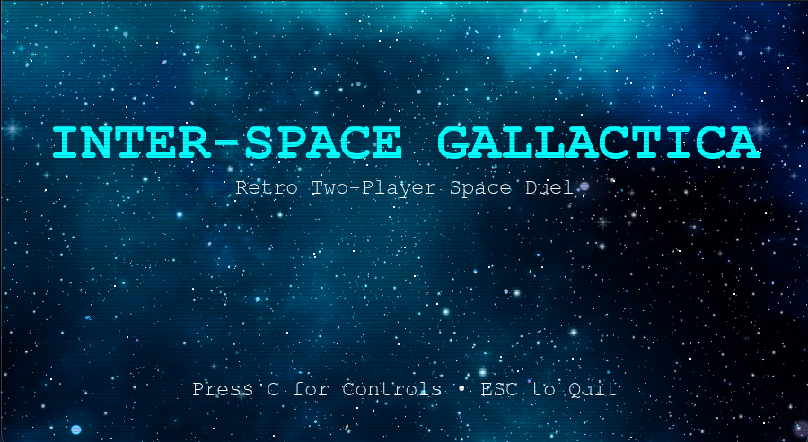
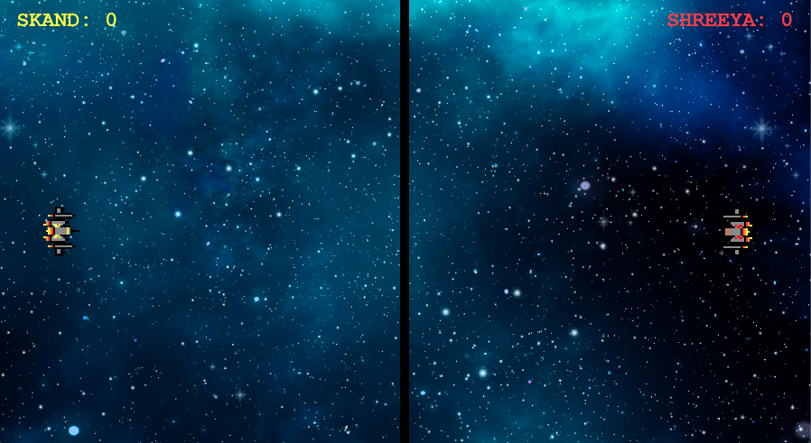
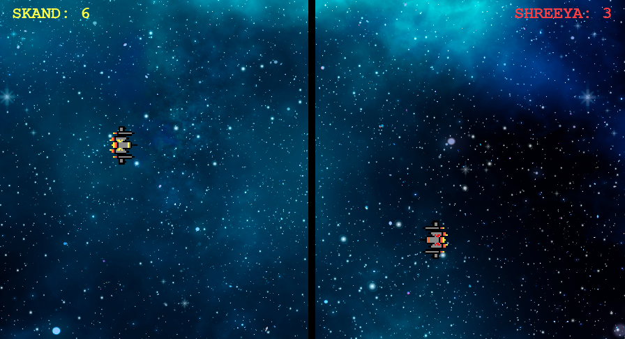

# 🎮 Inter‑Space Gallactica — Retro Arcade Edition

A fast‑paced, two‑player retro space duel built with **Python + Pygame**, redesigned with a modular architecture and a full arcade presentation.

## ✨ Features

- 🚀 Two‑player local space duel
- 🧑‍🚀 Player name input (retro screen, uppercase, blinking cursor)
- 🏆 Per‑player stats stored in `scores.json`:
  - `wins`
  - `points` (total hits across all matches)
- 🎨 Retro visuals:
  - Animated starfield background
  - CRT scanline overlay
  - Flashing “PRESS ENTER TO START”
  - Pixel‑style fonts (Courier New)
- 🔊 Retro SFX (shots + hits)
- 🎮 Keyboard + optional gamepad support
- 📦 Cross‑platform desktop (macOS / Windows / Linux)

---

## 🕹️ Controls

### 🟡 Player 1 (Left)

- Move: **W A S D**
- Shoot: **TAB**

### 🔴 Player 2 (Right)

- Move: **Arrow Keys**
- Shoot: **ENTER**

### 🎮 Gamepad (optional, if connected)

- Move: Left stick / D‑pad
- Shoot: Button A / Cross

---

## 🔁 Flow

1. Start screen
2. Press **ENTER** → Start Game
3. Enter **PLAYER 1 NAME** (uppercase, max 12 chars)
4. Enter **PLAYER 2 NAME**
5. Play match
6. Game Over screen:
   - Shows winner
   - Shows match points
   - Shows cumulative stats from `scores.json`
7. Press **ENTER** → back to menu  
   Press **ESC** → quit

---



---

## 📦 Installation & Running

### 1. Install Python 3.9+

Make sure `python` or `python3` is available in your terminal.

### 2. Run the game

```bash
python main.py
# or
python3 main.py

